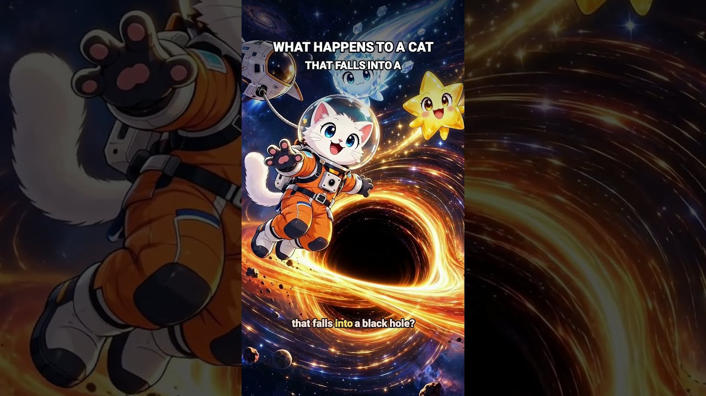
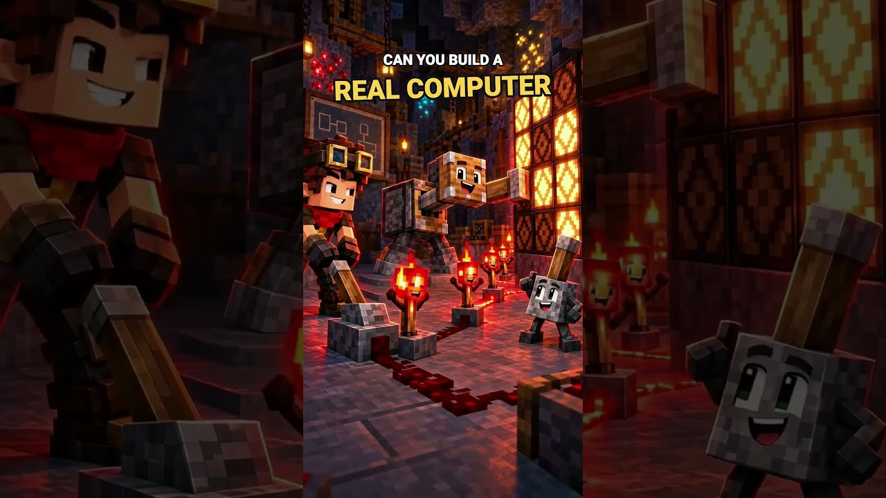
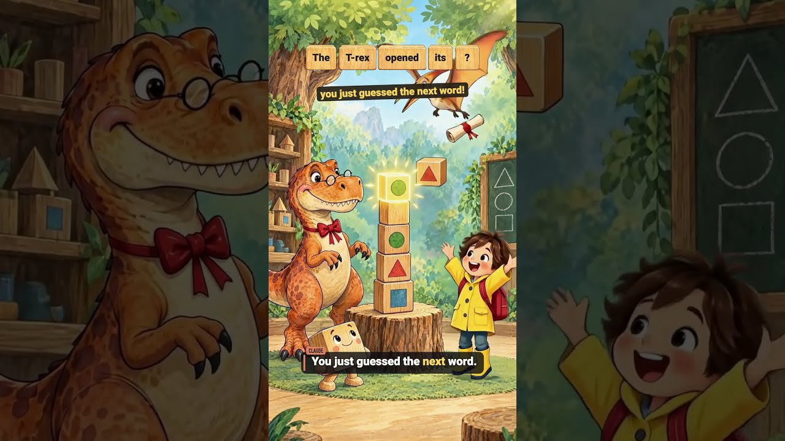
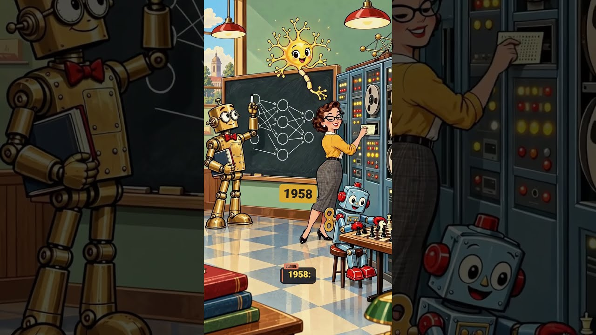

# Motion Graphics Animated Lesson

Version **0.2.0**.

A Claude Code plugin for creating narrated cartoon lessons from a topic, paper, repository or script. It combines character acting with p5 diagrams, code, captions and camera moves, then adds music ducked under dialogue, a theatrical curtain call and animated credits.

The plugin includes its reusable artwork, curtain still images, animation and timing recipes and all five original music beds.

## Videos created with this skill

Seven examples made with this skill. Click a thumbnail to watch on YouTube.

| Sample video 1 | Sample video 2 | Sample video 3 |
| :---: | :---: | :---: |
| <a href="https://www.youtube.com/shorts/7o23EHl1fnw"></a> | <a href="https://www.youtube.com/shorts/UQequFn0Vzo"></a> | <a href="https://www.youtube.com/shorts/Cg2-ZvbYNHY"></a> |
| @makevoid · 2:54 | @makevoid · 2:59 | @makevoid · 2:57 |
| <br> | <br> | <br> |
| **Sample video 5** | **Sample video 6** | **Sample video 7** |
| <a href="https://www.youtube.com/shorts/pdTGocsiMRM"></a> | <a href="https://www.youtube.com/shorts/ZW9zP9ST7Vs"></a> | <a href="https://www.youtube.com/shorts/XxAlN73aRS4"></a> |
| @makevoid · 2:46 | @makevoid · 3:00 | @makevoid · 2:50 |
| <br> | <br> | <br> |
| **Sample video 8** |  |  |
| <a href="https://www.youtube.com/shorts/5H6qg7669PM"></a> |  |  |
| @makevoid · 2:55 |  |  |

## Install and invoke

Open your Terminal and paste the installation commands:

```
claude plugin marketplace add makevoid/motion-graphics-animated-lesson-plugin
claude plugin install motion-graphics-animated-lesson@makevoid-animated-lesson
```

Then start  Claude Code by executing `claude` and then paste:

```sh
/plugin configure motion-graphics-animated-lesson@makevoid-animated-lesson 
```


Enter your Fal AI API key and the setup is done!

Now you can proceed on Claude Code TUI or on close the terminal and use the Claude desktop app. 

### Claude Desktop instructions

Open a new Claude Code session, add a folder to it and then execute: 

```
/motion-graphics-animated-lesson
```


The plugin will load and you will be good to go to prompt away!


You can follow the question that Claude asks one by one or you can just test a prompt such as "create a minecraft viral video on something about computer science, use 480p vertical format, 30s video no intro no outro, make a banger!" (this should cost max 5$ of Fal AI MiniMax H3 credits).


This example data: Opus 5.5 Medium - 355k Token Used - Fal AI usage: 3 $ - Note it reused the guidelines of the 2 default character contained in the skill, feel free to prompt to override them at the beginning of this process.


Check the `output` directory when claude is finished or just ask claude to show you the video if you are in the Claude desktop app and it didn't show the video to you.

Note - for continuing on Claude Code do the same but on a terminal.

Enjoy!


### Tools the plugin uses

Before generating a video, you can install some of these dependencies, which on Mac OS should be easy to install - they're not required, you could prompt the skill to do as much as it can with just basic Ruby, NodeJS and Python but you get the best of results if you have everything as Opus will be able to have access to all the powerful tools in the toolkit. The skill if you don't have some will work as well but if you want it to work best I recommend you do them all, you can leave the VFX one out, that's really optional. NodeJS is highly recommended to have as you will get much better in-frame animations with it.

- Python 3 (should be installed already)
- Homebrew https://brew.sh/ - this is needed to install the other dependencies
- Ruby 3.2+ with Bundler (Mac OS comes with it with 2.6 - this should work as well but the agent will spend some time setting the project up, I recommend you try to install ruby via homebrew)
- Node.js 22+ - https://nodejs.org/en/download
- FFmpeg (from homebrew)
- ImageMagick (also from brew)
- Swift VFX and the full test suite require macOS 14+ with Swift 5.9+ / Xcode command line tools - that is very much optional but recommended

### License

The toolkit code is MIT licensed. Preserved user-supplied artwork and model outputs retain their original provenance and applicable terms. System fonts selected into a project keep their own licenses.

---

Feel free to contribute to this repo and enjoy using this plugin!

## External services and data sharing

The local MCP server and CLI use these external services:

- **Fal API and storage** (`queue.fal.run`, `rest.alpha.fal.ai`, and provider-returned media URLs): authentication, prompts, narration/lyrics, settings, and selected images/audio/video for generation, transcription, and stem separation. Uploaded media links may be accessible to anyone with the link; the plugin does not automatically delete remote assets.
- **Fal schemas** (`fal.ai/api/openapi/queue/openapi.json`): model identifiers for schema lookup.
- **Web research:** search queries and reference URLs go to Claude's configured search provider and visited sites.
- **Setup and updates:** package requests go to RubyGems, npm, and PyPI (or configured mirrors); plugin installation and updates contact GitHub.

Editing, rendering, mixing, and exports run locally. Project files retain briefs, scripts, media, and generation metadata, including personal data supplied in that content. No maintainer telemetry or automatic social publishing is included. Normal Claude conversation and tool-result handling still applies.
